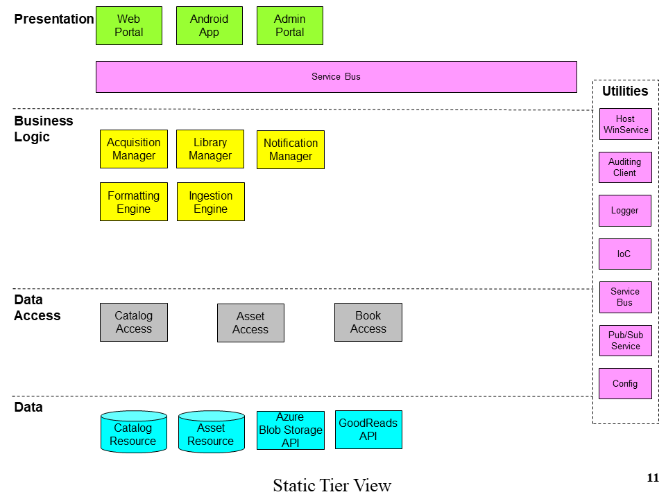
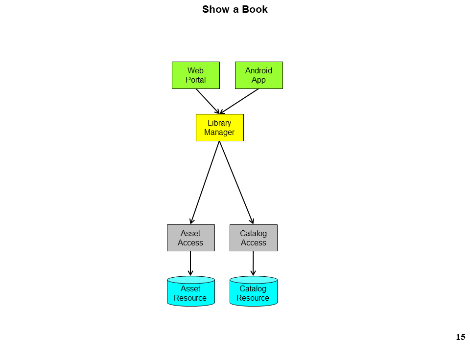
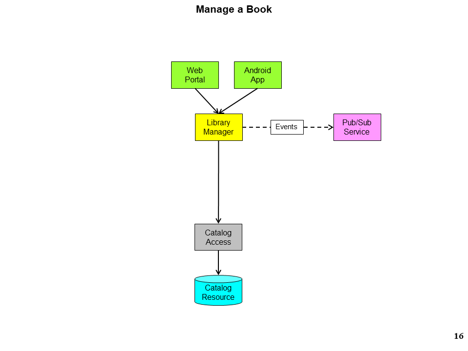
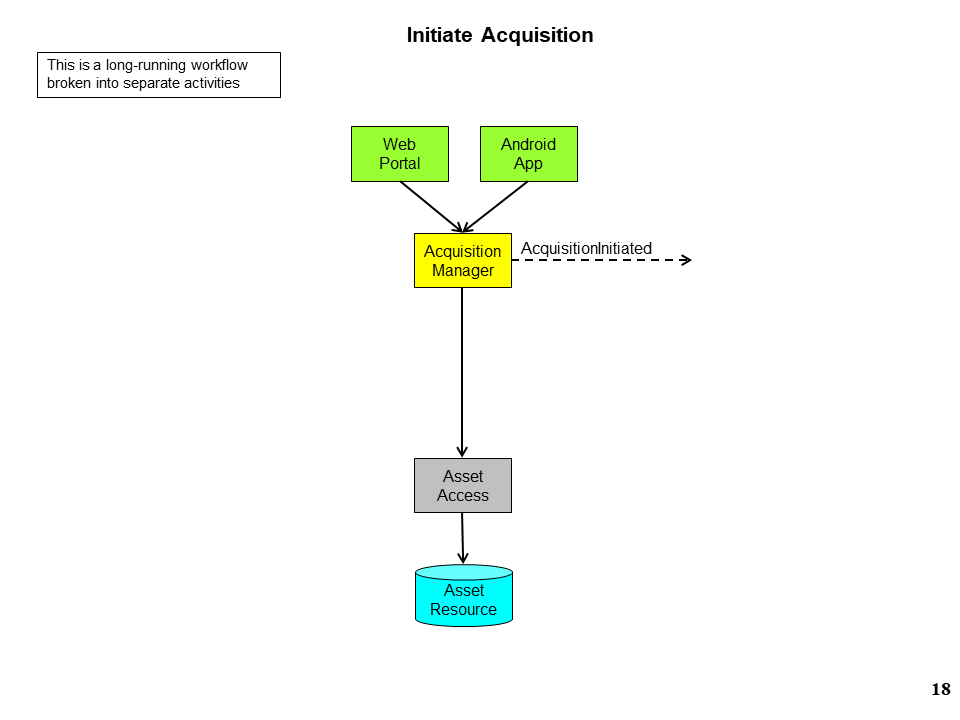
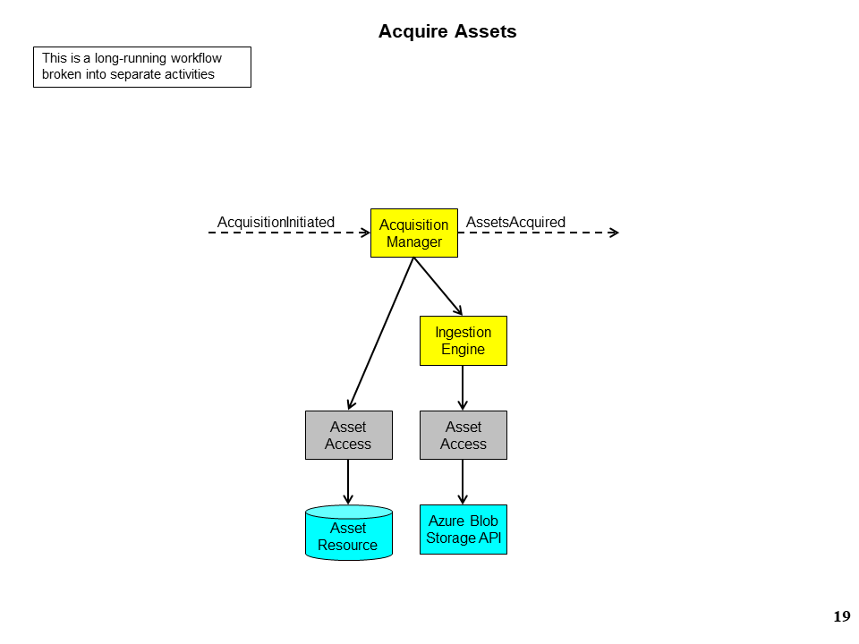
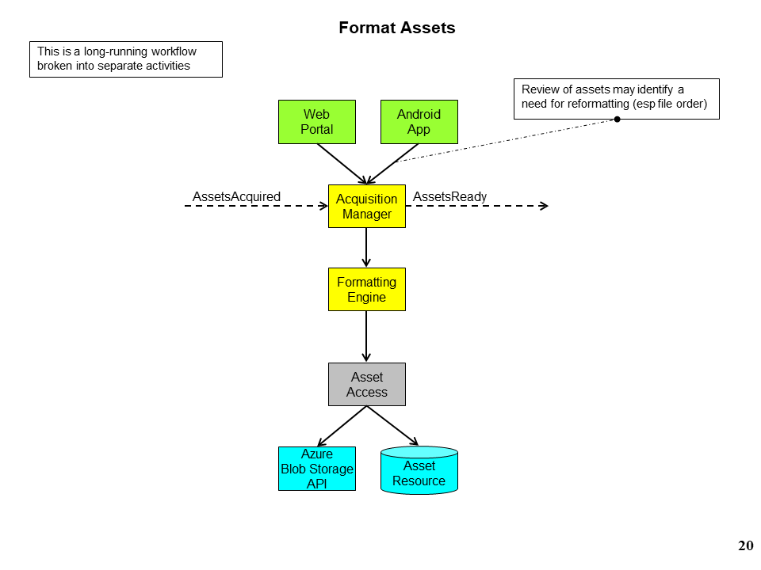
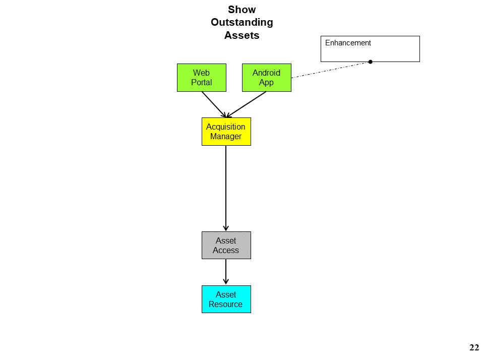
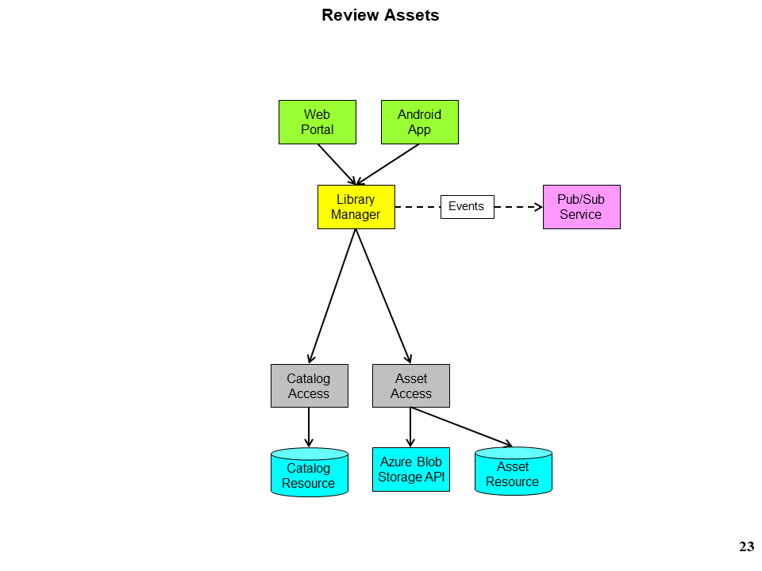
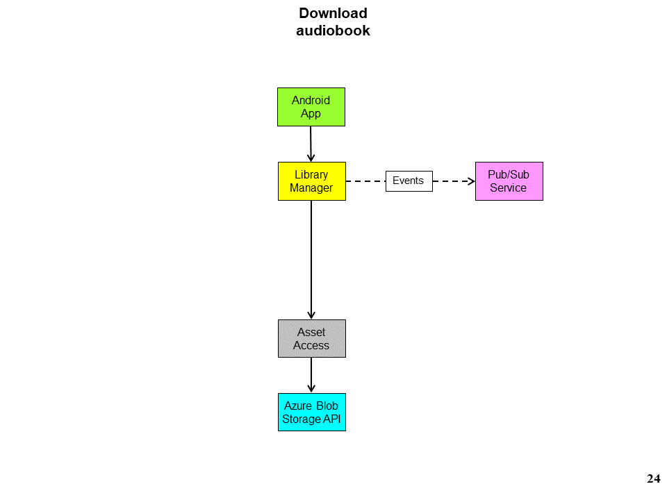
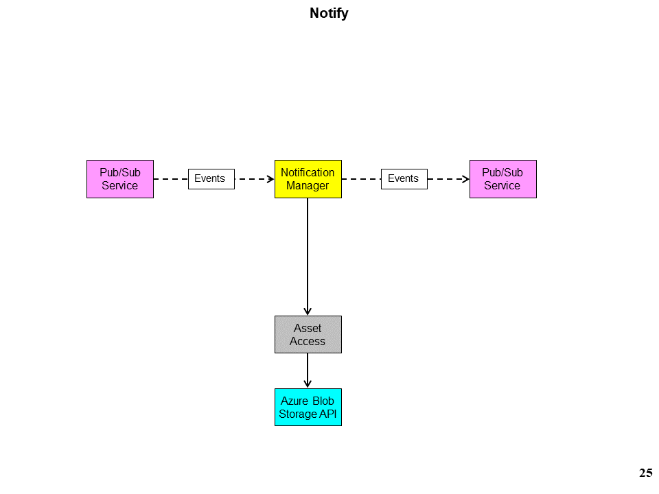

# Audiobook Application

## Mission Statement
Create a system for simple, ethical acquisition and consumption of audiobooks.

_This system is not intended to be used in the thieft of intellectual property._

## Glossary
* **Assets**: Audio files related to a given book from a single acquisition source.
* **Acquisition source**: There may be several sources for audio files for a single book. The downloaded audio files from a single source constitute one set of raw assets. A book may have multiple sets of assets (usually prior to review).
* **Raw Assets**: Unchanged audio files with original metadata, ID3 tags, naming convention, etc. from an original, external source. _Note: Raw assets are kept indefinitely in case of need to transform again later due to improvements._
* **Assets**: Constitutes a listenable audiobook file along with one or more sample audio files (to be used during review).
* **Transformation**: Converting raw assets into a single m4b formatted file, taking one or more samples for review. Once audio files have been transformed, they are ready for review.
* **Review**: The process of assessing whether or not to choose a given set of assets for a book. Can also result in reassigning to a different book. _Oops, these are the Philippics, not the Tusculan Disputations!_

## Objectives
* Have an app on my phone that I can use to quickly pull audiobooks down.
* Let the audiobooks be in an uncluttered, easy-to-consume format.
* Be able to acquire audio assets from more than one source until a suitable (passes review) set of assets are found.

## Operational Concepts
* **Queuing**: One-way messages are reliably and asynchronously sent to a manager for consumption.
* **Pub/Sub**: Events are published from managers. Clients and other managers may listen for these events.
* **Reliable Actors**: ReliableActors may be used for persistence and reminders. Never for both persistence and logic.

## Areas of Volatility
* **Multiplicity of Clients**: Encapsulated in separated clients. There are separate user interfaces for separate purposes
    * Android application
    * Web portal
    * Admin portal
* **Library Management**: Encapsulated in LibraryManager. What to do with books I want to listen to, find books I’ve already listened to, etc.
* **Asset Acquisition Workflow**: Encapsulated in AcquisitionManager.
* **Asset Preparation**: Encapsulated in FormattingEngine. Encoding, combining into single resource, extracting metadata from source file(s), handling different source file formats, encodings, naming formats
* Dependencies on external APIs
    * **Book Metadata**: Encapsulated in BookAccess. Format, API changes (GoodReads API)
    * **Asset Persistence**: Encapsulated in AssetAccess. Storage of both metadata and audio file, API changes
    * **Asset Ingestion Mechanism**: Encapsulated in AssetAccess. The process of ingesting audiobook assets depends on the source:
        * plain, old, unauthenticated download
        * an internet storage-based drop box
        * one or more YouTube videos
        * files accessible directly on the network
    * **Personal Library**: Encapsulated in CatalogAccess. Assets transformation and acquisition are common to anyone using the system, however an individual tenant's personal library (catalog) is distinct.

### Static Tier View of Components

## Use Cases
* **Find a Book**: Search for a book by title, author, series, etc.

* **Show a Book**: Show metadata for a given book in your library along with audiobook asset information.

* **Manage a Book**: Add or remove a book from your library.

* **Initiate Acquisition**: Begins a long-running workflow that will ingest external audiobook files and reformat them for review and consumption. This is largely an asynchronous process from the caller's point of view.

* **Acquire Assets**: In this activity, remote audio assets are ingested and made local to the system. Upon completion, events are fired indicating whether the assets were successfully retrieved or not.

* **Format Assets**: 

* **Show Outstanding Assets**: Show assets that have not finished being acquired or are ready for review.

* **Review Assets**: Mark the assets as to whether they are suitable for being listened to.

* **Download Audiobook**: Download the audiobook onto a phone so that it can be listened to.

* **Notify**: Listens to events and sends alerts as-configured for the given listener. (I want to receive a push notification on my phone when I have new assets ready for review, but another user wants to receive SMS or email.)

[//]: #not-sure-if-this-use-case-has-a-place-here "Find Asset Sources: Search for audiobook files on your computer, YouTube, LibriVox, etc. There are multiple readings in the public domain for many books. As such, some will be preferable to others. A book can have any number of sources for acquisition. Once they are retrieved, they are reviewed for technical and aesthetic acceptability."

#### Non-Functional Core Use Cases
Also out of scope.
* **Business Intelligence**: View instrumentation and metrics, external API health, past and projected costs.
* **Backup System**: Backup state of system in cold storage.
* **Restore System**: Restore entire system from cold storage state.

